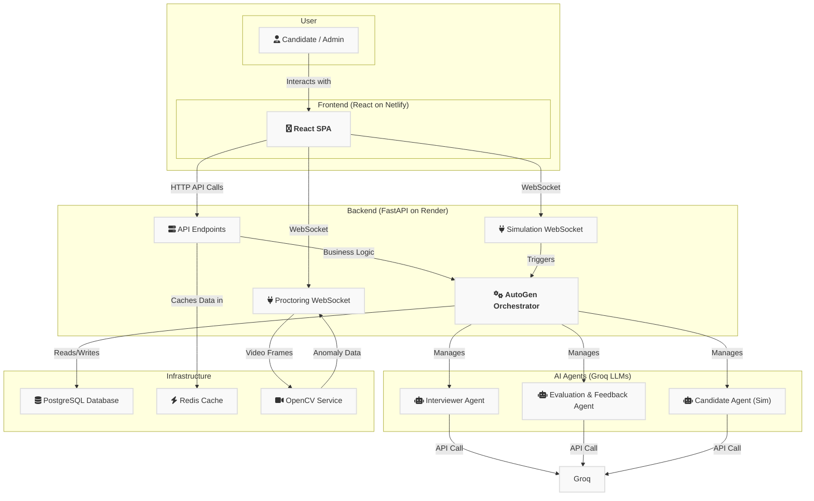

# Multi-Agent-Interviewer
<p align="center">
  
  
  
  
  
  
</p>
An autonomous, multi-agent AI system (AutoGen, Groq) that conducts, proctors, and evaluates technical Excel interviews in real-time. Built with FastAPI and React.
An end-to-end, full-stack application designed to automate the technical screening process for Excel-proficient roles. This platform leverages a sophisticated multi-agent system to conduct dynamic, real-time interviews, provide intelligent skill evaluation, and generate detailed performance reports to streamline the hiring pipeline.

__Note:__ Open Excel Sheet button is enabled but there is no Excel sheet provided by me, therefore, it will show that "No Sheets are provided". Its not an error, anyone can provide the sheets link in the code for running the project.

## 🚀 Live Demo

**Check out the live deployed application:** **[Live Demo Link](https://mock-interviewer-cn.netlify.app/)**

*   **Admin Login:** `admin1@cn.com` / `Admin@123`
*   **Candidate Login:** `candidate1@abc.com` / `Candidate@123`

---
## 🖼️ Project Showcase

<table>
  <tr>
    <td align="center">
      <em>Candidate Dashboard</em><br/><br/>
      
    </td>
    <td align="center">
      <em>Interview Details</em><br/><br/>
      
    </td>
  </tr>
  <tr>
    <td align="center">
      <em>Live Interview Interface</em><br/><br/>
      
    </td>
    <td align="center">
      <em>Admin Dashboard (Application List)</em><br/><br/>
      
    </td>
  </tr>
  <tr>
    <td align="center">
      <em>Candidate Application Details</em><br/><br/>
      
    </td>
    <td align="center">
      <em>AI-Generated Report Modal</em><br/><br/>
      
    </td>
  </tr>
  <tr>
    <td align="center">
      <em>Interview Transcript Modal</em><br/><br/>
      
    </td>
    <td align="center">
      <em>Agent Analytics and Agent Simulation (Real-time)</em><br/><br/>
      
    </td>
  </tr>
</table>
---
## ✨ Key Features

*   **🤖 Multi-Agent Conversation:** Utilizes Microsoft's AutoGen framework to orchestrate a natural, multi-turn interview between specialized AI agents.
*   **🧠 Intelligent Evaluation:** Employs high-performance LLMs from Groq (GPT-OSS, Llama-4, Gemma2) for nuanced question generation, response evaluation, and report creation.
*   **🎥 Real-time Proctoring:** Features a live proctoring agent built with OpenCV that streams video from the candidate's webcam to detect anomalies like screen deviation, multiple faces, or persistent gaze aversion.
*   **📝 Dynamic Feedback Loop (RAG):** The system "learns" from admin feedback. Submitted critiques are stored and fed back into the Interviewer Agent's context for future interviews, improving its performance over time.
*   **📊 Comprehensive Admin Dashboard:** An intuitive interface for admins to review candidate applications, view detailed interview transcripts, analyze AI-generated performance reports, and provide feedback.
*   **⚙️ Live Agent Simulation:** A real-time, turn-by-turn simulation between the Interviewer and a mock Candidate Agent, allowing admins to monitor and test agent behavior.
*   **☁️ Fully Deployed:** A complete CI/CD pipeline with the backend deployed on Render (PostgreSQL) and the frontend on Netlify.

---

## 🏛️ System Architecture

This project follows a modern, decoupled full-stack architecture. The frontend is a Single Page Application (SPA) that communicates with a backend REST API and WebSocket services.


## 🛠️ Tech Stack

### Category	Technology
* __Backend__	


* __Frontend__


* __AI__	


* __Database__	


* __Deployment__	


## 🔧 Setup and Local Installation
To run this project on your local machine, follow these steps.
### Prerequisites
1. Git
2. Python 3.11+
3. Node.js
4. npm
5. Redis (running on the default port 6379)
   
#### 1. Clone the Repository
```Bash
git clone https://github.com/[YOUR_GITHUB_USERNAME]/[YOUR_REPOSITORY_NAME].git
cd [YOUR_REPOSITORY_NAME]
```
#### 2. Backend Setup
Run all commands from a new terminal in the /backend directory.
```
# 1. Navigate to the backend folder
cd backend

# 2. Create and activate a virtual environment
python -m venv .venv
# Windows
.\.venv\Scripts\activate
# MacOS/Linux
source .venv/bin/activate

# 3. Install dependencies
pip install -r requirements.txt

# 4. Create a .env file and fill in your API keys
cp .env.example .env 
# Now, open the .env file and add your secret keys.

# 5. Start the backend server
uvicorn main:app --reload
```
The backend will be running at http://localhost:8000.
#### 3. Frontend Setup
Run all commands from a new, separate terminal in the /frontend directory.
```
# 1. Navigate to the frontend folder
cd frontend

# 2. Install dependencies
npm install

# 3. Create a .env file for the frontend
# The file should contain: REACT_APP_API_BASE_URL=http://localhost:8000/api
cp .env.example .env

# 4. Start the frontend server (with HTTPS for camera access)
npm start
```
The frontend will open at https://localhost:3000.
## 🚀 Deployment
The application is deployed with a CI/CD pipeline:
* __Backend (FastAPI):__ Deployed as a Web Service on Render, connected to a managed PostgreSQL database. The deployment automatically rebuilds on every push to the main branch.
* __Frontend (React):__ Deployed on Netlify, linked to the same GitHub repository. It includes a _redirects file to correctly handle SPA routing.
## 🗺️ Future Roadmap

* Implement a persistent vector database (e.g., Pinecone, ChromaDB) for a more scalable RAG implementation.

* Introduce robust JWT-based user authentication for both candidates and admins.

* Fine-tune a smaller, open-source model on high-quality interview transcripts to reduce reliance on external APIs.

* Expand the admin dashboard with more detailed analytics on agent performance and candidate success rates.

* Add support for different roles and interview types (e.g., Python, SQL).

