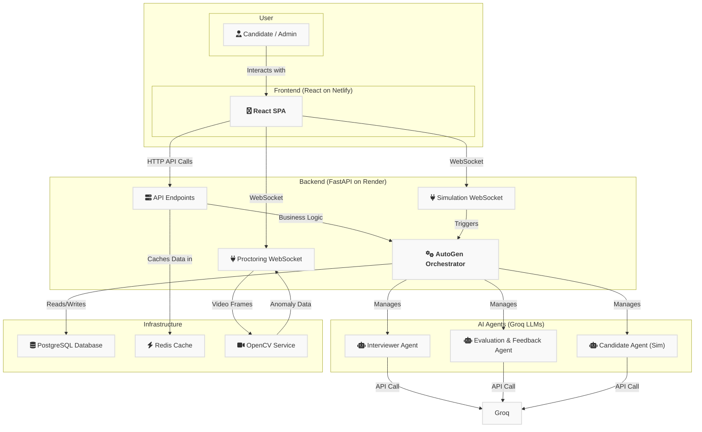

# Reflex

```mermaid
graph TD
    %% Define Styles
    classDef default fill:#f9f9f9,stroke:#ddd,stroke-width:2px;
    
    subgraph " "
        direction LR
        subgraph "Frontend (React on Netlify)"
            B["<div style='padding: 10px; font-weight: bold;'>fa:fa-react React SPA</div>"]
        end
        subgraph "User"
            A["fa:fa-user-tie Candidate / Admin"]
        end
    end

    subgraph "Backend (FastAPI on Render)"
        C["fa:fa-server API Endpoints"]
        D["fa:fa-plug Proctoring WebSocket"]
        E["fa:fa-plug Simulation WebSocket"]
        F["<div style='padding: 10px; font-weight: bold;'>fa:fa-cogs AutoGen Orchestrator</div>"]
    end
    
    subgraph "AI Agents (Groq LLMs)"
        G["fa:fa-robot Interviewer Agent"]
        H["fa:fa-robot Evaluation & Feedback Agent"]
        I["fa:fa-robot Candidate Agent (Sim)"]
    end

    subgraph "Infrastructure"
        J["fa:fa-database PostgreSQL Database"]
        K["fa:fa-bolt Redis Cache"]
        L["fa:fa-video OpenCV Service"]
    end

    %% Connections
    A -- Interacts with --> B
    B -- HTTP API Calls --> C
    B -- WebSocket --> D
    B -- WebSocket --> E
    
    C -- Business Logic --> F
    D -- Video Frames --> L
    E -- Triggers --> F
    
    F -- Manages --> G
    F -- Manages --> H
    F -- Manages --> I
    
    G -- API Call --> Groq
    H -- API Call --> Groq
    I -- API Call --> Groq
    
    F -- Reads/Writes --> J
    C -- Caches Data in --> K
    
    L -- Anomaly Data --> D
```

koi bnao isko humko btao

https://reflex.dev/docs/getting-started/chatapp-tutorial/

https://github.com/Fosowl/agenticSeek

